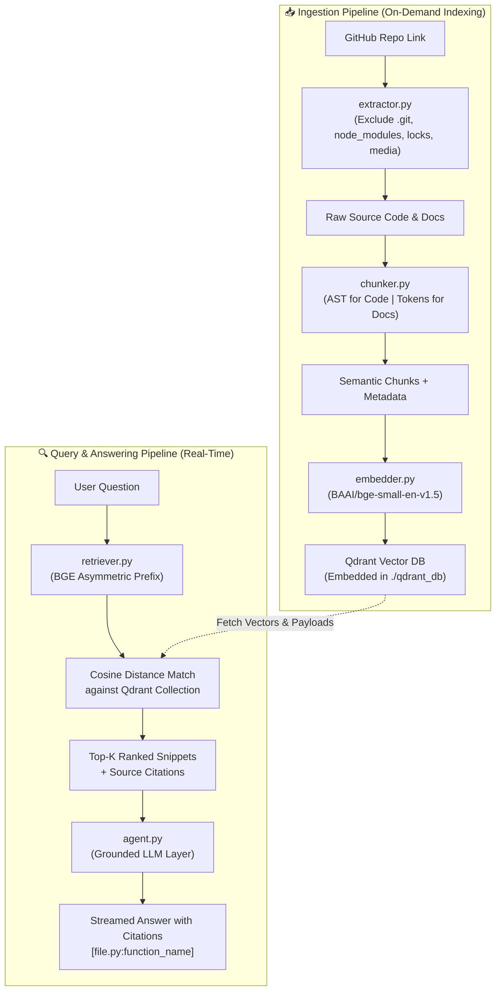
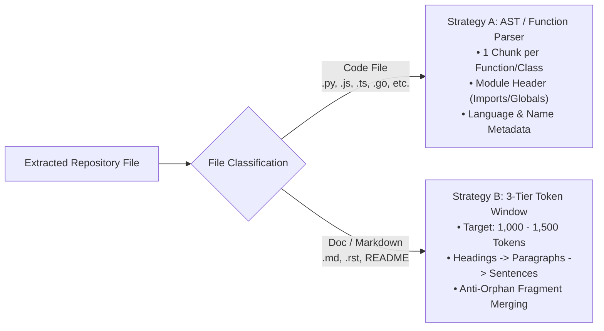

# Gito — Technical Architecture & Developer Reference

> **Comprehensive guide to Gito's backend architecture, data pipelines, vector database schema, and code map.**

---

## 1. High-Level Architecture & Data Flow



---

## 2. Core Technology Stack Cheat Sheet

| Layer | Technology | Key Implementation Detail |
|---|---|---|
| **Extraction** | GitHub REST API v3 / `requests` | Recursive tree retrieval (`git/trees?recursive=1`), downloads raw files from `raw.githubusercontent.com`. |
| **Tokenization** | `tiktoken` (`cl100k_base`) | Used for doc chunk token counting and window sizing. |
| **Code Parser** | Python `ast` + Regex Heuristics | AST tree parsing for Python classes/functions; regex detection for JS, TS, Java, Go, Rust, C++. |
| **Embeddings** | `BAAI/bge-small-en-v1.5` (`sentence-transformers`) | 384-dimensional dense vectors; L2-normalized; asymmetric query prefixing (`"Represent this sentence: "`). |
| **Vector DB** | `qdrant-client` (Embedded Local Disk) | On-disk persistence in `./qdrant_db/`; collection per repository (`owner_repo`); rich payload metadata storage. |
| **LLM Answering** | `groq` / `openai` / `python-dotenv` | Grounded system prompt enforcing citations and strict factual alignment with retrieved code. |

---

## 3. Dual-Strategy Chunking Engine



---

## 4. Qdrant Vector DB Schema

Each indexed chunk is stored in Qdrant as a `PointStruct` with:
- **Vector**: 384-dimensional `float32` array (L2 normalized, cosine metric).
- **Payload**:
  ```json
  {
    "filepath": "src/database.py",
    "name": "database.py:connect_db",
    "chunk_type": "code",
    "language": "python",
    "content": "def connect_db(): ...",
    "token_count": 128
  }
  ```

---

## 5. Code Map & Developer Reference (What Each File Does)

| File | Primary Functions & Classes | When to Modify |
|---|---|---|
| [`extractor.py`](file:///c:/Users/yadav/OneDrive/Desktop/PROJECTS/Serious%20One's/Gito%20-%20Github%20repo%20Agent/extractor.py) | `extract_repo()`, `is_excluded()`, `parse_github_url()` | When adding new ignored file extensions (e.g. `.log`, `.wasm`), tweaking git branch logic, or modifying secret detection. |
| [`chunker.py`](file:///c:/Users/yadav/OneDrive/Desktop/PROJECTS/Serious%20One's/Gito%20-%20Github%20repo%20Agent/chunker.py) | `chunk_repository()`, `chunk_code_file()`, `chunk_doc_file()` | When adding support for new programming languages, adjusting the 1,000–1,500 token window size, or modifying heading boundary splitting. |
| [`embedder.py`](file:///c:/Users/yadav/OneDrive/Desktop/PROJECTS/Serious%20One's/Gito%20-%20Github%20repo%20Agent/embedder.py) | `Embedder.embed_chunks()`, `Embedder.embed_query()` | When swapping embedding models (e.g., to BGE-base or voyage-code), tuning batch size, or modifying query prefixes. |
| [`qdrant_store.py`](file:///c:/Users/yadav/OneDrive/Desktop/PROJECTS/Serious%20One's/Gito%20-%20Github%20repo%20Agent/qdrant_store.py) | `QdrantVectorStore.index_chunks()`, `.search()`, `.list_collections()` | When changing Qdrant storage directory (`./qdrant_db`), connecting to remote Qdrant Cloud clusters, or adding payload filter fields. |
| [`retriever.py`](file:///c:/Users/yadav/OneDrive/Desktop/PROJECTS/Serious%20One's/Gito%20-%20Github%20repo%20Agent/retriever.py) | `Retriever.retrieve()`, `Retriever.format_context()` | When tuning `top_k`, setting minimum cosine similarity score cutoffs, or changing how snippets are formatted for the prompt. |
| [`agent.py`](file:///c:/Users/yadav/OneDrive/Desktop/PROJECTS/Serious%20One's/Gito%20-%20Github%20repo%20Agent/agent.py) | `GitoAgent.answer()`, `SYSTEM_PROMPT` | When updating Gito's system persona, modifying prompt grounding rules, adjusting LLM temperature, or adding new LLM providers. |
| [`main.py`](file:///c:/Users/yadav/OneDrive/Desktop/PROJECTS/Serious%20One's/Gito%20-%20Github%20repo%20Agent/main.py) | `main()`, `chat_loop()`, `select_or_add_repository()` | When modifying CLI menu options, adding commands (e.g., `:stats`), or connecting backend functions to a web frontend. |

---

## 6. How to Run

```bash
# 1. Full interactive terminal:
python main.py

# 2. Re-generate PDF documentation anytime:
python generate_docs_pdf.py
```
